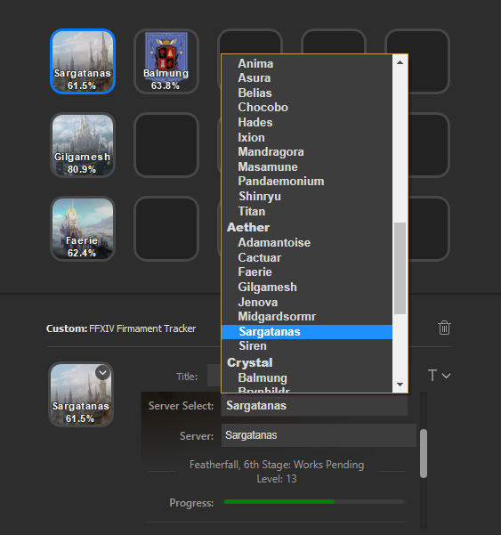

# FFXIV Firmament Tracker Plugin for the Elgato StreamDeck

StreamDeck is an external LCD key macro device that allows the installation of plugins to improve productivity.

Final Fantasy XIV is a MMORPG video game.

## Description

`FFXIV Firmament Tracker Plugin` reads the FFXIV Ishguardian Restoration [Builders' Progress Report](https://na.finalfantasyxiv.com/lodestone/ishgardian_restoration/builders_progress_report) and displays server progress percentages on your StreamDeck.

The website updates every hour, so the plugin updates every 1m after the hour and on initialization.

You can drag and drop multiple plugins to display more than one server if desired.

Clicking the button will open up the Builders' Progress Report web page.

Compatible with Windows.

## Installation

In the Release folder, you can find the file `com.elgato.ffxivfirmament.streamDeckPlugin`. If you double-click this file on your machine, StreamDeck will install the plugin.

Folder: https://github.com/momokotomoko/ffxivStreamDeckFirmamentTrackerPlugin/Release

If an installation was previously present, you must delete the plugin folder located in Elgato's AppData folder. For example: `C:\Users\<username>\AppData\Roaming\Elgato\StreamDeck\Plugins`

## Settings

`Title`

The title is automatically set by the plugin to display the server name and progress percentage.

`Server Select`

Select a server from the dropdown menu to track.

`Server`

Textbox where you can type the name of the server to track, in case it is not in the dropdown menu.

`Font`

Servers with longer names can use the `T` drop down menu to select a different font size.

## Source Code

The source code can be found in the Sources folder.

## Developed By

[Momoko Tomoko from Sargatanas](https://na.finalfantasyxiv.com/lodestone/character/1525660/)

